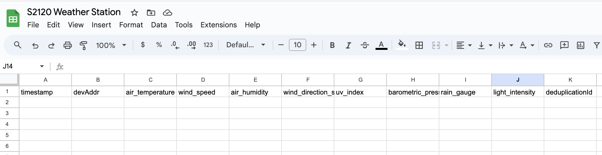

# Integrating Google Sheets

This guide walks through the steps to set up a Google Sheet to capture data from a device on the Meteoscientific Console using a Google Apps Script. 

Conceptually what we'll do is send the data from the device to a Google script, which will then fill in a Google sheet.

I'll be using a weather station, the [SeeedStudio S2120 8-in-1 LoRaWAN version.](https://metsci.ai/s2120-gsheet), but you can use any device you'd like.

## Prerequisites

- A device already set up on the [MetSci console](https://console.meteoscientific.com/front/).
- A Google account 

## Step 1: Create a Google Sheet

1. Open [Google Sheets](https://sheets.google.com/) and create a new spreadsheet.
2. Name your spreadsheet something relevant, like "S2120 Weather Station"
3. For our weather station, I'll add the following column headers in the first row (starting at A1):

> timestamp, devAddr, air_temperature, wind_speed, air_humidity, wind_direction_sensor, uv_index, barometric_pressure, rain_gauge, light_intensity, deduplicationId


4. Your sheet should now look something like this:




## Step 2: Create a Google Apps Script

1. In your Google Sheet, go to `Extensions > Apps Script`. This opens the Google Apps Script editor.
2. Replace the default code with the following script:

```javascript
function doPost(e) {
  try {
    // Parse the incoming JSON data
    var payload = JSON.parse(e.postData.contents);

    var sheet = SpreadsheetApp.getActiveSpreadsheet().getSheetByName('Sheet1');
    
    // Extract relevant data from the root of the payload
    var deduplicationId = payload.deduplicationId || '';
    var timestamp = payload.time || new Date();
    var devAddr = payload.devAddr || '';
    
    // Initialize variables for weather data with default values
    var air_temperature = 0;
    var wind_speed = 0;
    var air_humidity = 0;
    var wind_direction_sensor = 0;
    var uv_index = 0;
    var barometric_pressure = 0;
    var rain_gauge = 0;
    var light_intensity = 0;

    // Check if the "object" field exists and is an object
    if (payload.hasOwnProperty('object') && typeof payload.object === 'object') {
      var data = payload.object;
      air_temperature = data.hasOwnProperty('air_temperature') ? data.air_temperature : 0;
      wind_speed = data.hasOwnProperty('wind_speed') ? data.wind_speed : 0;
      air_humidity = data.hasOwnProperty('air_humidity') ? data.air_humidity : 0;
      wind_direction_sensor = data.hasOwnProperty('wind_direction_sensor') ? data.wind_direction_sensor : 0;
      uv_index = data.hasOwnProperty('uv_index') ? data.uv_index : 0;
      barometric_pressure = data.hasOwnProperty('barometric_pressure') ? data.barometric_pressure : 0;
      rain_gauge = data.hasOwnProperty('rain_gauge') ? data.rain_gauge : 0;
      light_intensity = data.hasOwnProperty('light_intensity') ? data.light_intensity : 0;
    }
    
    // Append the data to the next available row in the sheet
    sheet.appendRow([
      timestamp,
      devAddr,
      air_temperature,
      wind_speed,
      air_humidity,
      wind_direction_sensor,
      uv_index,
      barometric_pressure,
      rain_gauge,
      light_intensity,
      deduplicationId
    ]);
    
    // Return a success response
    return ContentService.createTextOutput(JSON.stringify({status: 'success'}))
                         .setMimeType(ContentService.MimeType.JSON);
  } catch (error) {
    // Return error response
    return ContentService.createTextOutput(JSON.stringify({status: 'error', message: error.message}))
                         .setMimeType(ContentService.MimeType.JSON);
  }
}
```
Save the script by clicking the disk icon or pressing Ctrl + S (Windows) or Cmd + S (Mac).

# Step 3: Deploy the Script as a Web App
After saving the script, click on the Deploy button in the top-right corner of the editor.


Select **Manage Deployments**.

Click on **New Deployment**.

Under Select Type, choose **Web App**.

You can give your deployment a description like WxStation_v1, but it's optional.

Set the access level to **Anyone**, even anonymous (this is necessary for ChirpStack to be able to send data to the script).

Click **Deploy**.

Now you'll see a few things.  Copy the Web App URL that is generated. This is the endpoint (the link you'll past into the http integration) you'll use in ChirpStack.

# Step 4: Configure the HTTP Integration in MeteoScientific
Log in to your MeteoScientific Console account.

Go to the **Applications** section and select your application.

Navigate to the **Integrations** tab.

Under HTTP Integration, click Add.

In the Event Endpoint URL(s) field, paste the Web App URL you copied from Google Apps Script.


Make sure the payload encoding is set to JSON.

**Optional** I've heard that adding a header with `Content-Type` and then `application/json` will make it work.  Only try that if you need to.  It would look like this:


Click Submit to save the integration.

# Step 5: Test the Integration
If you can trigger the device (I couldn't on the weather station since it was deployed), fire off an uplink.  If you can't trigger it, just...wait for your device to send an uplink.

Check your Google Sheet to see if the data has been appended to the next available row.  It should look like this:


If the data appears correctly, your integration is successfully set up!

# Troubleshooting
The devil will be in the details here, and it may take you a few tries of "Deploying" the script to get it to work. 

No Data in Google Sheet: Ensure that your script is correctly deployed. Double-check that the Web App URL is correctly configured in the MetSci Console.

Missing Fields: Make sure that your script is handling all possible fields from the payload, and that the default values are correctly set when data is missing.