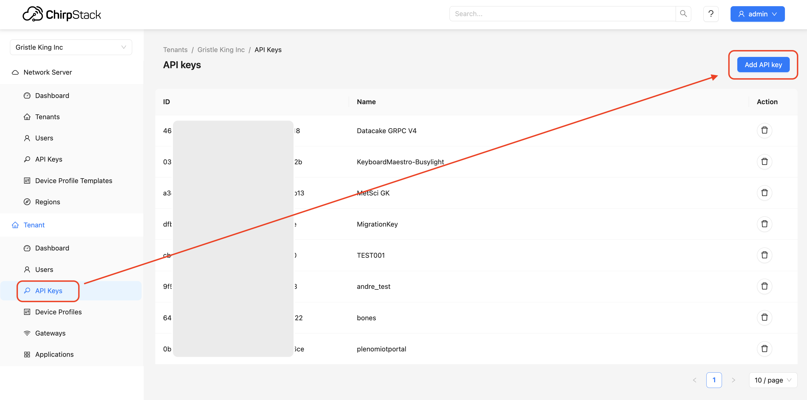
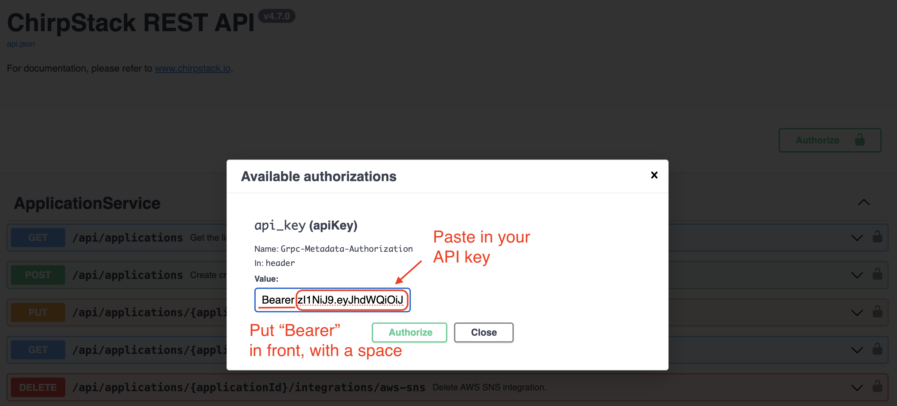
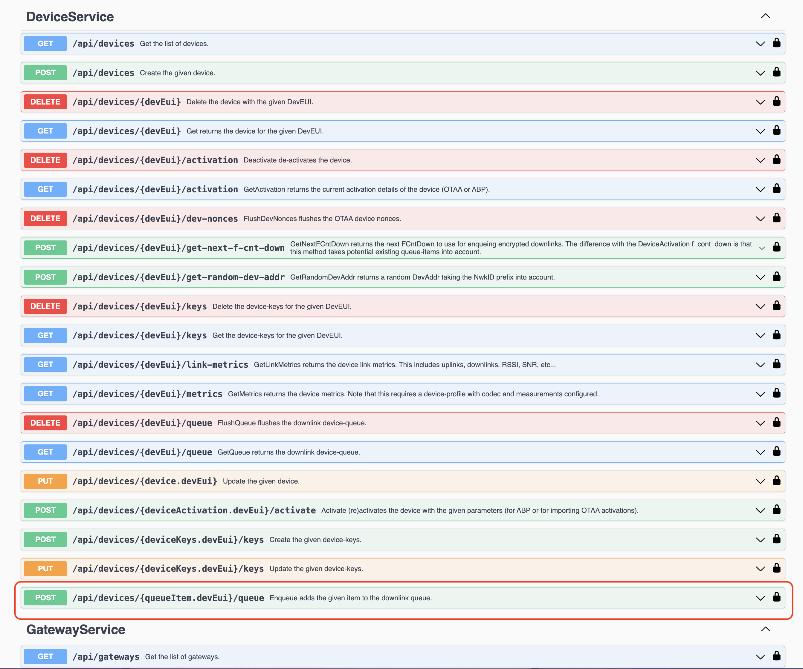
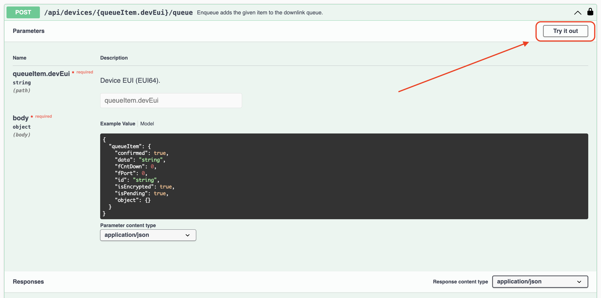
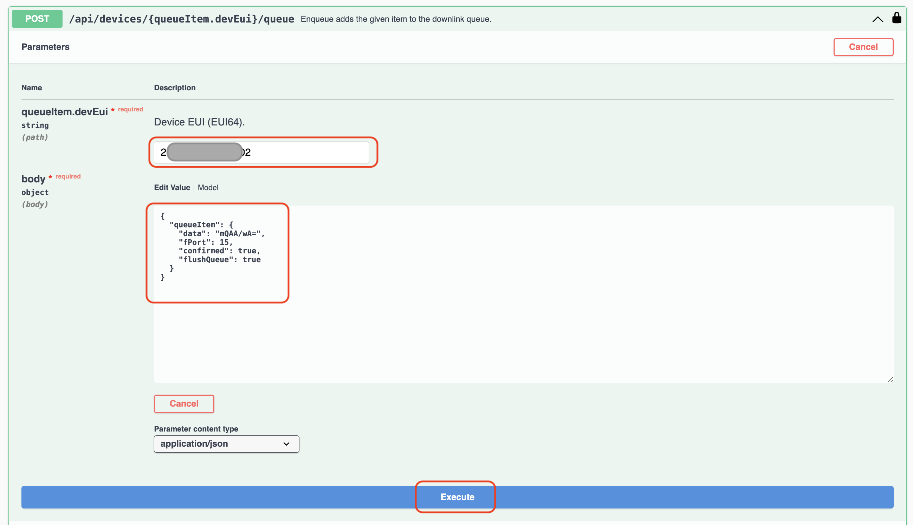
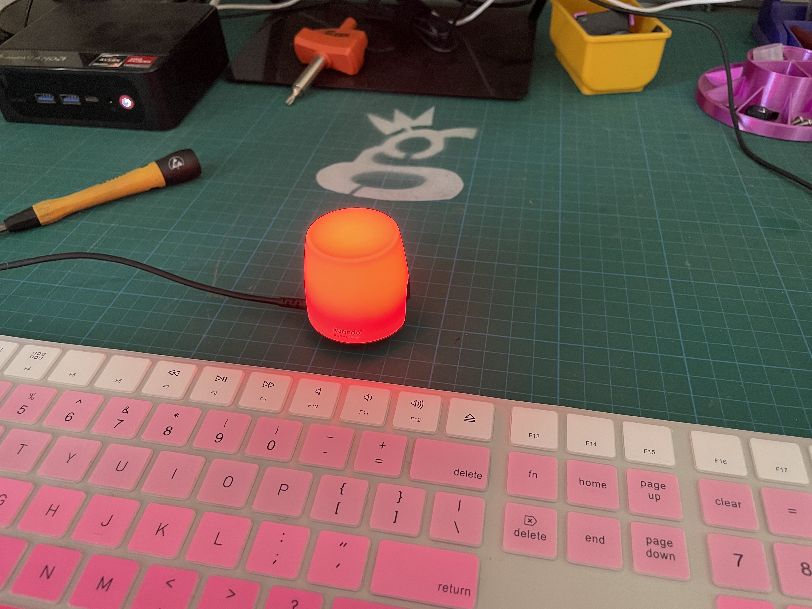

# Class C via API

This guide walks you through using Meteoscientific's API to control a Kuando Busylight via a script. The guide assumes you can follow directions and copy/paste. We will demonstrate how to enqueue a command using the Meteoscientific REST API to control the light.

## Prerequisites

1. **API Access:** You need access to Meteoscientific's REST API. Sign up and generate your authorization token via the [Meteoscientific Console](https://console.meteoscientific.com/front/login).  If you don't know how to generate your authorization token, relax, I'll walk you through it a little later on.
2. **Bash Shell:** Ensure you have a Bash shell available on your system.  You probably do.  If not, get Google or ChatGPT to help you add it.
3. **Curl:** This command-line tool is used to make HTTP requests. If you don’t have it installed, you can install it with your package manager (e.g., `sudo apt install curl`).

---

## Overview

Class C devices are ones that are always "listening" for commands.  You can trigger those commands directly in the MetSci Console to test, but if you want to use a class C device without logging into Console, try using an API, or Application Programming Interface.  Now you're getting fancy!

Relax, we'll walk you through it.  

For this tutorial, we'll use a Kuando Busylight, which is a little light that'll light up with any color (even flashing ones!) you want when you tell it to via the Helium LoRaWAN.

As it says in the prerequisites, you'll need to be logged into your Console account (and already have your Busylight set up in there).

## Step 1: Understand the API Call

**For the nerds:**  We will use the following endpoint to send the command to the Busylight:

```
POST /api/devices/{queueItem.devEui}/queue
```

This endpoint enqueues a message in the downlink queue for a specific device identified by its `devEui`. 

- **Headers:**
  - `Authorization: Bearer <YOUR_TOKEN>`: The token you obtained from the Meteoscientific console.
  - `Accept: application/json`: The API expects and returns JSON.
  - `Content-Type: application/json`: The payload must be sent as JSON.

- **Payload Structure:**
  - `queueItem.data`: Base64-encoded command data. In this case, it represents the command to set the Busylight to solid red.
  - `fPort`: The port the data will be sent through.
  - `confirmed`: Indicates whether the message requires acknowledgment.
  - `flushQueue`: If true, flushes the queue before enqueuing the new message.

### For my non-nerds:  Let's do it step by step:

Start by generating an API key in your [Chirpstack Console](https://console.meteoscientific.com/front/login).  


**Save that somewhere secure**, you'll need it later!

Now, head over to the [SwaggerUI API page](https://console.meteoscientific.com/rest-api/) and let's test this sucker.  First, for the "Authorize" button, up at the top right.


Paste in "Bearer" then your API key and hit "Close".



Now scroll down to [just above Gateway Service](https://console.meteoscientific.com/rest-api/#/DeviceService/DeviceService_Enqueue) and expand the **POST** with **queue** in it, like this:



Expand that **POST** and then hit **Try it out**.



Fill in your **DevEUI** and the body:
```{
  "queueItem": {
    "data": "mQAA/wA=",
    "fPort": 15,
    "confirmed": true,
    "flushQueue": true
  }
}
```

Like this, then hit **Execute**.



You should see the **response curl** and your light should change color to red (`mQAA/wA=`)


Great, now you've got your curl script and the light works, woohoo!


---

## Step 2: Sample Bash Script to Control the Light

Now you can use a Bash script to send a command to the Busylight using the Meteoscientific API:

```bash
#!/bin/bash

# API endpoint
URL="https://console.meteoscientific.com/api/devices/2020203736130202/queue"

# Authorization token (replace this with your actual token)
AUTH_TOKEN="[Your MetSci API key here, without Bearer in front]"

# Payload data (base64-encoded)
DATA="mQAA/wA="  # This is the base64-encoded payload for solid red

# Making the API request with curl
curl -X POST "$URL" \
  -H "Accept: application/json" \
  -H "Authorization: Bearer $AUTH_TOKEN" \
  -H "Content-Type: application/json" \
  -d '{
        "queueItem": {
          "data": "'"$DATA"'",
          "fPort": 15,
          "confirmed": true,
          "flushQueue": true
        }
      }'

```

This script does the following:

1. **API Endpoint:** The script points to the device's queue endpoint.
2. **Authorization Token:** A JWT token is used for authentication. Replace the placeholder with your actual token.
3. **Payload Data:** The `DATA` variable contains a base64-encoded string, which represents the command to set the light to solid red. You can modify this data for other colors or actions.
4. **Curl Command:** The script uses `curl` to make an HTTP POST request to the API endpoint, passing the necessary headers and payload.

---

## Step 3: Explanation of the Payload

- **`data`:** The base64-encoded payload represents the command for the Kuando Busylight. In this example, the value `mQAA/wA=` sets the light to solid red. 
  - You can generate different base64 commands depending on the color or pattern you want the Busylight to display.
- **`fPort`:** This indicates the port number. For the Busylight, port `15` is typically used.
- **`confirmed`:** Setting this to `true` means the message requires confirmation from the device.
- **`flushQueue`:** This option ensures that the device queue is cleared before adding this new command, ensuring immediate execution.

---

## Step 4: Running the Script

1. Save the script to a file, e.g., `control_busylight.sh`.
2. Make the script executable:

   ```bash
   chmod +x control_busylight.sh
   ```

3. In Terminal, run the script:

   ```bash
   ./control_busylight.sh
   ```

If everything is set up correctly, the Kuando Busylight should change to the color or pattern specified by the base64 payload.

Now you've got a script that uses the API to make your Busylight turn colors (or off).  Congrats!

---

## Streamdeck & Keyboard Maestro Integration

I got a little fancy and set up a script to turn the light red, green, purple, flashing blue, and off using my Streamdeck.  Use the script above as a template, modifying the actual command each time, then save each of those as a separate script, and trigger them with buttons on your Streamdeck.  Easy day.  Here are the colors I used plus a Yellow in case ya need it:

```
1. Solid Red:
Hex: 990000FF00
Base64: mQAA/wA=

2. Solid Green: 
Hex: 000099FF00
Base64: AABZ/wA=

3. Solid Yellow: 
Hex: FF00FF6400
Base64: /wD/ZAA=

4. Solid Purple:
Hex: FFFF006400
Base64: //9AZAA=

5. Blue Flashing (1 sec on/off):
Hex: 00FF000A0A
Base64: AP8ACgo=

6. Off:
Hex: 00000000FF
Base64: AAAAAP8=
```

## Troubleshooting

Unnecessary.  I don't see how anything could possibly go wrong.  

---

By following this guide, you can control your Kuando Busylight via the Meteoscientific API. This is useful for creating automation scripts or integrating the light with other tools.

For further reference, consult the [Meteoscientific API documentation](https://console.meteoscientific.com/rest-api/) to explore more API capabilities.
